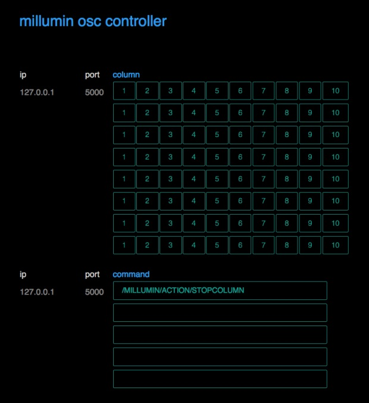

# osccontroller
https://www.millumin.com multi display osc controller

Here is a quite basic but a useful script for any OSC command to any machine as long as you know the IP address.  
Just increase any of the 3 loops in the script according to your needs.  

https://www.wjst.de/blog/sciencesurf/2017/12/multi-millumin-osc-controller/

 
  
